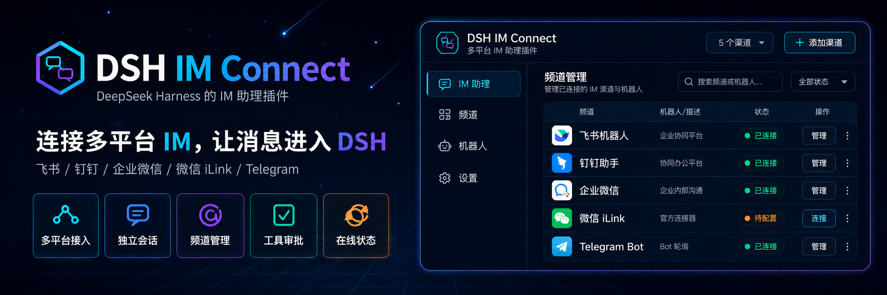
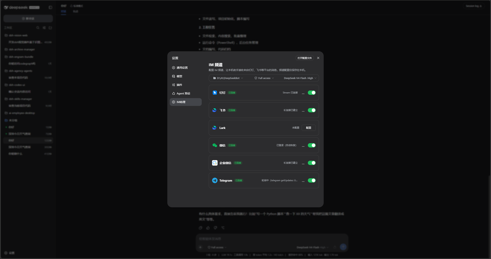
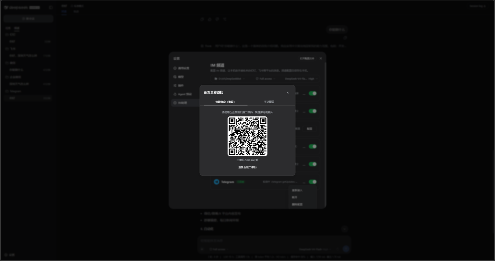
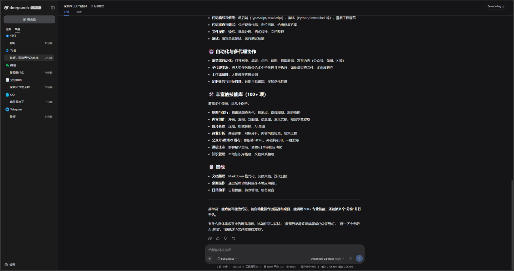
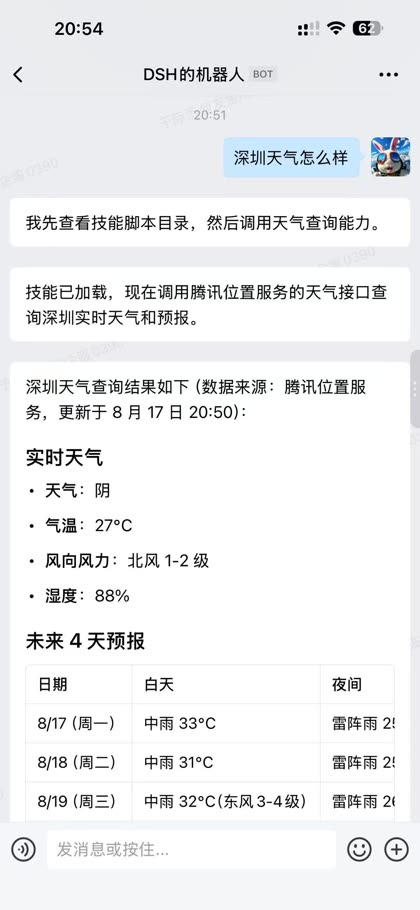
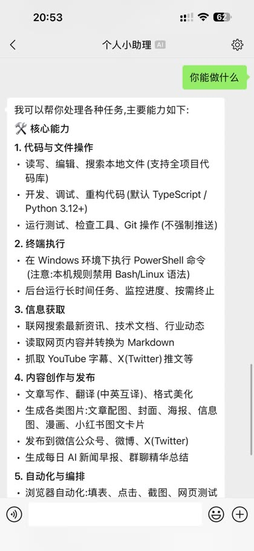
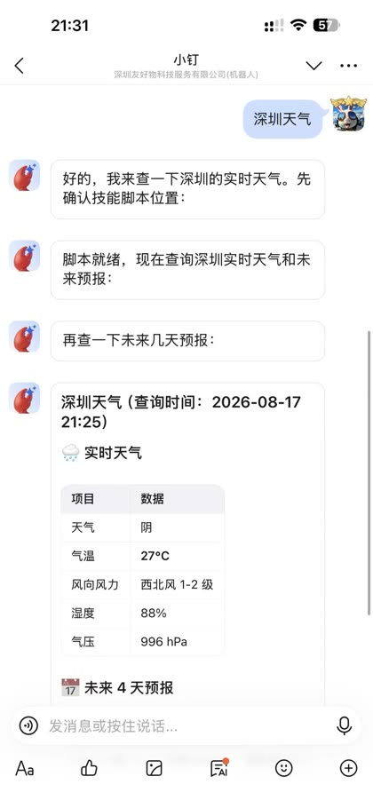
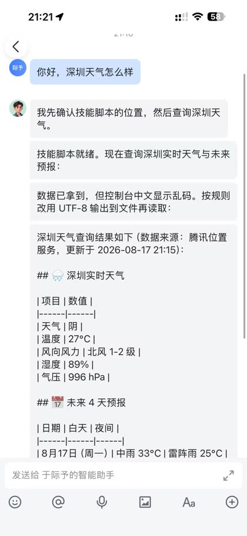
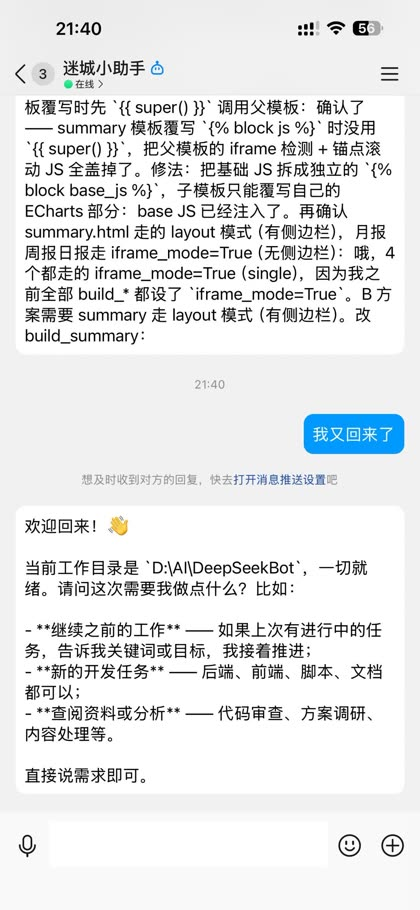
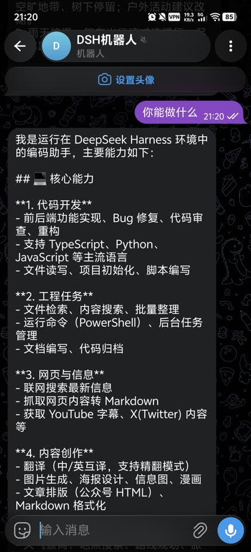

# 使用说明

更新时间：2026-08-18 00:10（Asia/Shanghai）

## 适用范围

本说明面向已经能打开 DeepSeek Harness Web 的使用者。插件把本机 DSH agent 接到常用 IM，会话出现在工作区「频道」，不进入网页「任务」。

安装、代装话术和源码开发见仓库根目录 [README.md](../../README.md)。这里只写装好之后怎么用。

  

> 插件把飞书、钉钉、企业微信、微信、QQ、Telegram 接到本机 DeepSeek Harness。

## 第一次打开

1. 安装后重启 `dsh web`，并在浏览器硬刷新。
2. 打开「设置 → IM助理」。
3. 在页面顶部选择工作区、权限和模型。这三项只影响频道会话，不会改网页任务。
4. 未选择模型时，新建 IM 会话会提示先在本页设置。

  

> 设置页按渠道列出卡片。未连接显示「配置」，已连接显示绿色「已连接」标签和开关。

## 连接渠道

点击未连接卡片上的「配置」，会打开居中弹窗。不要去「插件」列表里找表单。

| 渠道 | 状态 | 绑定方式 | 需要准备什么 |
|---|---|---|---|
| 🔔 钉钉 | ✅ 可用 | 扫码，或手动填 Client ID / Client Secret | 钉钉开放平台机器人应用 |
| 🐦 飞书 | ✅ 可用 | 仅扫码，自动创建机器人 | 飞书账号 |
| 🌐 Lark | ✅ 可用 | 仅扫码，走国际版域名 | Lark 账号 |
| 💬 微信 | ✅ 可用* | 仅官方 iLink 二维码 | 建议使用专用小号，仅私聊 |
| 🏢 企业微信 | ✅ 可用 | 快捷绑定扫码（推荐），或手动填 Bot ID / Secret | 企业微信智能机器人 |
| 🐧 QQ | ✅ 可用 | 扫码，或手动填 AppID / AppSecret | QQ 开放平台机器人，不是个人 QQ 号 |
| ✈️ Telegram | ✅ 可用 | 仅手动填 Bot Token | `@BotFather` 创建的 Bot；同一 Bot 不要同时开 Webhook |

✅ 可用 = 文字收发可用 ｜ *微信 = 只走腾讯官方 iLink

  

> 企业微信默认走「快捷绑定」。用企业微信扫描二维码即可；二维码超时后可重新生成。

扫码成功后，本机保存凭据并启动渠道，弹窗关闭，卡片变为「已连接」。已连接卡片可以：

- 用开关暂停或恢复收消息，凭据会保留。
- 用 `...` 菜单断开、重新接入或查看状态。

## 在工作区回看

设置页只负责连机器人。聊起来之后，会话出现在工作区左侧「频道」。

  

> 左侧「任务」是网页会话，「频道」是 IM 会话。点某一行可在网页里回看，但不会把它变成任务。

| 页签 | 里面有什么 |
|---|---|
| 任务 | DSH 原网页会话，不含任何 `im:` 前缀会话 |
| 频道 | 按钉钉、飞书、微信、企业微信、QQ、Telegram 分组的 IM 聊天 |

机器人断开后，该渠道分组仍可看历史，只是不再接收新消息。

## 在 IM 里对话

私聊直接发文字即可。群聊必须 @ 机器人，否则不会回复。

每个 IM 聊天对应一条独立 DSH 会话。模型和工具跟随设置页当前选择，缺省再用当前 profile。

### 斜杠命令

| 命令 | 作用 |
|---|---|
| `/help` | 显示帮助 |
| `/status` | 查看当前频道会话 |
| `/new` 或 `/clear` | 开启全新会话，只影响当前 IM 聊天 |
| 结尾 `..` | 还有后续，先进入合并窗口 |
| 结尾 `!!` | 立即提交，不等待合并窗口 |

默认合并窗口约 5 秒，适合连续补一句需求。

### 工具批准

需要批准时，助手会在同一条 IM 聊天里提示。回复下面任一即可：

- 批准：`批准`、`同意`、`yes`、`y`、`allow`
- 拒绝：`拒绝`、`no`、`n`、`reject`、`deny`

不能跨聊天批准。超时后交给本机处理。

## 各渠道效果

连上后，手机里可以直接问天气、查资料、改代码，回复会出现在对应 IM 和网页「频道」里。

### 企业微信

  

> 企业微信智能机器人可接收任务并返回结构化结果。

### 微信

  

> 微信只走官方 iLink。发送「你能做什么」可查看本机助手能力。

### 钉钉

  

> 钉钉优先使用官方 AI Card 流式卡片；创建失败时回退普通文本。

### 飞书

  

> 飞书扫码后即可私聊。长回复会按渠道规则分片发送。

### QQ

  

> QQ 接入的是开放平台机器人，不是个人号。私聊可直接说「我又回来了」继续上次工作；群聊需要 @。

### Telegram

  

> Telegram 使用 Bot Token 轮询。同一 Bot 不要同时开启 Webhook，否则会抢消息。

## 数据保存在哪

状态目录默认是 `%DSH_HOME%\dsh-im-connect`，未设置 `DSH_HOME` 时为 `%USERPROFILE%\.dsh\dsh-im-connect`。

| 文件 | 内容 |
|---|---|
| `channels.json` | 启用状态、凭据引用，不含明文 Secret |
| `sessions.json` | IM 聊天到 DSH 会话的映射 |
| `secrets.json` | 仅在没有 `ctx.credentials` 时作为后备 |
| `gateway.log` | 运行日志 |

微信登录态会额外写到 `weixin\wechat-state.json`。Telegram 游标写到 `telegram\cursor.json`。

## 常见问题

| 现象 | 处理方式 |
|---|---|
| 设置里没有「IM助理」 | 确认 `dsh --profile web --dump-config` 已挂载 `im-connect`，然后重启 DSH Web 并硬刷新。 |
| 扫码弹窗不出码 | 确认本机可访问对应平台；点「重新生成二维码」。微信必须走官方 iLink。 |
| 私聊没回复 | 看卡片是否已连接且开关打开；打开 `gateway.log` 查启动错误。 |
| 群里没回复 | 先 @ 机器人。未 @ 的群消息默认不处理。 |
| Telegram 收不到消息 | 同一 Bot Token 不要同时开 Webhook；只保留本插件轮询。 |
| 网页「任务」里出现 IM 会话 | 这是异常。应只在「频道」里看到；请回报并附会话 id。 |
| 工具批准没反应 | 必须在发起批准的同一条聊天里回复「批准」或「拒绝」。 |
| 仍然显示旧界面 | 重新加载插件，重启 DSH Web，并强制刷新浏览器缓存。 |

## 明确不做

- 不接入 Claude Code、Codex、Cursor 等外部 CLI。
- 不做成独立守护进程。
- 不使用逆向个人微信协议。
- 第一期不承诺图片、文件等完整媒体收发。
